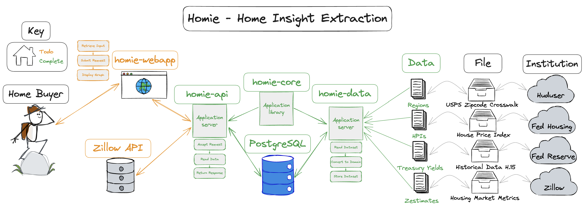
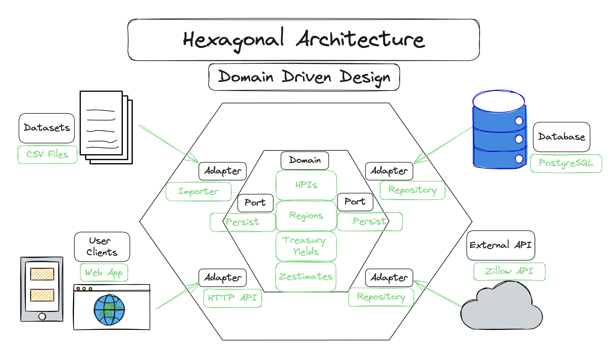

# homie 🏠📊 - Home Insight Extraction <span style="float:right;"> </span>
    

## Description 💡
Homie aims to display visualizations of housing market datasets.

It answers two vital questions:
1. What value of a home is fair? 💰
2. What value of a mortgage interest rate is fair? 📈

### Diagram



The technology stack was chosen by stacks I'm unfamiliar or interested in.

##### homie-api
This service hosts an HTTP API which reads and serves the dataset to the end user. I had not created HTTP servers with `axum` before, thus it was chosen.
Additionally, the focus was to extend its basic handlers with custom errors and extractors.

##### homie-core
This library's focus was to design the application with a `Hexagonal Architecture` approach. It has two main modules: adapters and domain.
The repository adapter has been abstracted to be capable of utilizing and database.

##### homie-data
This service reads CSV data and writes to an SQL database. Most of my experience is with NoSQL and Key-Value stores. Thus, I chose `SQLx` and `PostgreSQL`.
It has flexible configurations, and writes in accordance to its environment variables.

##### homie-webapp
This service will run server-sided-rendering (SSR) application for the end users. I have very little front end experience, and wanted to develop it entirely in Rust and chose the `Leptos` framework.
It is served as a WASM binary and utilizes `plotly` for interactive visualizations.

##### Datasets
Current datasets include [Zillow](https://www.zillow.com/research/data/), [FHFA](https://www.fhfa.gov/DataTools/Downloads/Pages/House-Price-Index-Datasets.aspx), [Fed Treasury](https://www.federalreserve.gov/releases/h15/), and Huduser.
The datasets are publicly available, downloaded and stored into Postgres. Zillow's public [API](https://www.zillowgroup.com/developers/) key can be requested for up to date information; however, their terms of service state that it cannot be stored into a database.

## Quick Start ⚡
### Requirements
Before getting started, make sure you have Docker installed and running. Also, install jq to run the bash script tests.

### Running
```
./local/run.sh
./local/test.sh
```
This script will pull and run the required images. It will locally deploy with a database, backend, and frontend.
Please check http://localhost:3000.

## MVP/Essential TODOs 📋
- [x] homie-core
    - [x] Define Domain
    - [x] Define Adapters
- [x] homie-data
    - [x] Read Dataset
    - [x] Convert to Application Domain
    - [x] Store into repository (Postgres)
        - [x] Regions (cities/counties/zipcodes)
- [x] homie-api
    - [x] Handle Request
    - [x] Retrieve Data
    - [x] Return Response
- [ ] homie-webapp
    - [ ] Get User's Query Params
    - [ ] Submit Request
    - [ ] Display Data in Graph

## Improvements
- [x] Local Development
    - [x] Automate creating database
        - [x] Can also initialize with `docker exec`
    - [x] Reduce local datasets size
        - [x] HPI
        - [x] Region
- [ ] Optimize ZHVI (batch insert prices)
- [x] Refactor
    - [x] Reduce public struct/fn exposure
    - [x] ~Read Bulder Pattern~ Won't use it, but I understand it
    - [x] Enums instead of Strings [Example](https://github.com/launchbadge/sqlx/discussions/3041)
    - [x] Repo/Import calls into Config
- [x] Error Handling
    - [x] ~ThisError and Anyhow~ Created a custom enum instead
    - [x] Logging
- [ ] Deployment
    - [x] [Dockerize](https://itnext.io/a-practical-guide-to-containerize-your-rust-application-with-docker-77e8a391b4a8)
    - [x] ~Push to dockerhub~ Going to use bash script to build and deploy
    - [ ] Read Zhvi from Zillow API
    - [ ] CI/CD
- [x] Testing ...I mean good enough?
    - [x] Unit tests :sob:
    - [x] E2E tests :sob:
